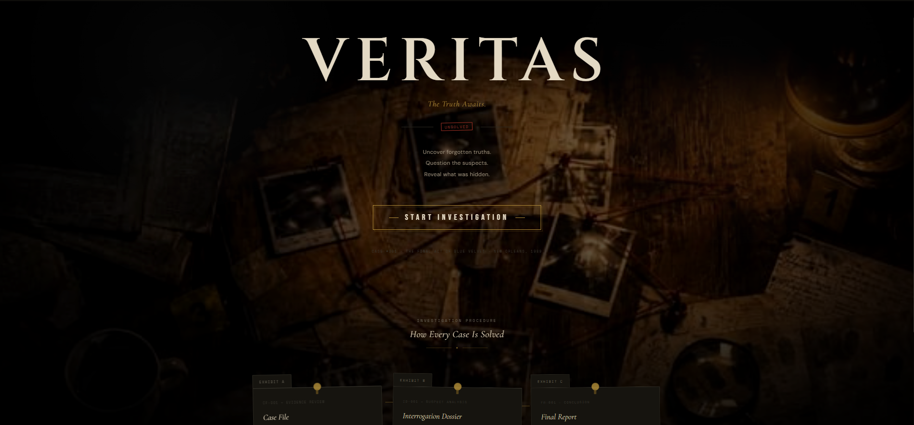
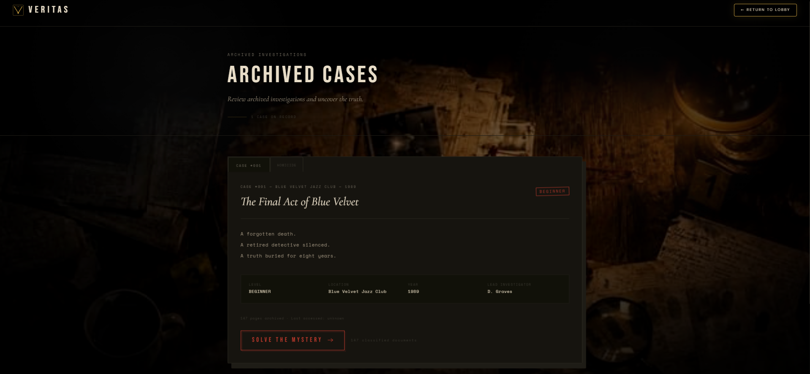
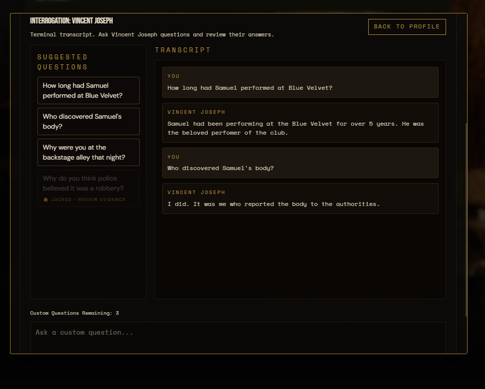

# VERITAS

🔗 Live Demo: https://veritas-eight-virid.vercel.app/

## Overview

VERITAS is an AI-assisted detective investigation gameplay web application where players solve cold cases through timeline analysis, evidence discoveries, suspect interrogation and deduction-based decision making.

Players examine evidence, question suspects, uncover hidden connections, and make a final accusation to determine the truth behind each investigation.

## Features

- Interactive detective investigation gameplay
- Evidence inspection system
- Evidence-aware question unlocking
- Suspect profiles and interrogation system
- Gemini-powered custom questioning
- Timeline analysis
- Final accusation system

## Screenshots

### Landing Page

### Cases

### Interrogation Panel

## Tech Stack

- Next.js
- React
- TypeScript
- Tailwind CSS
- Gemini API
- Vercel
